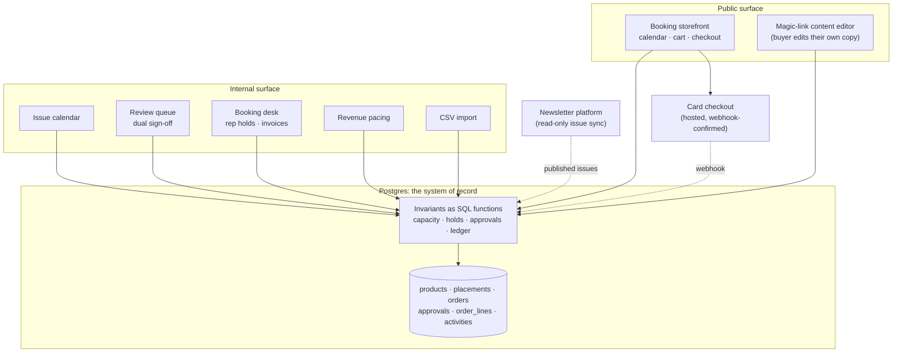
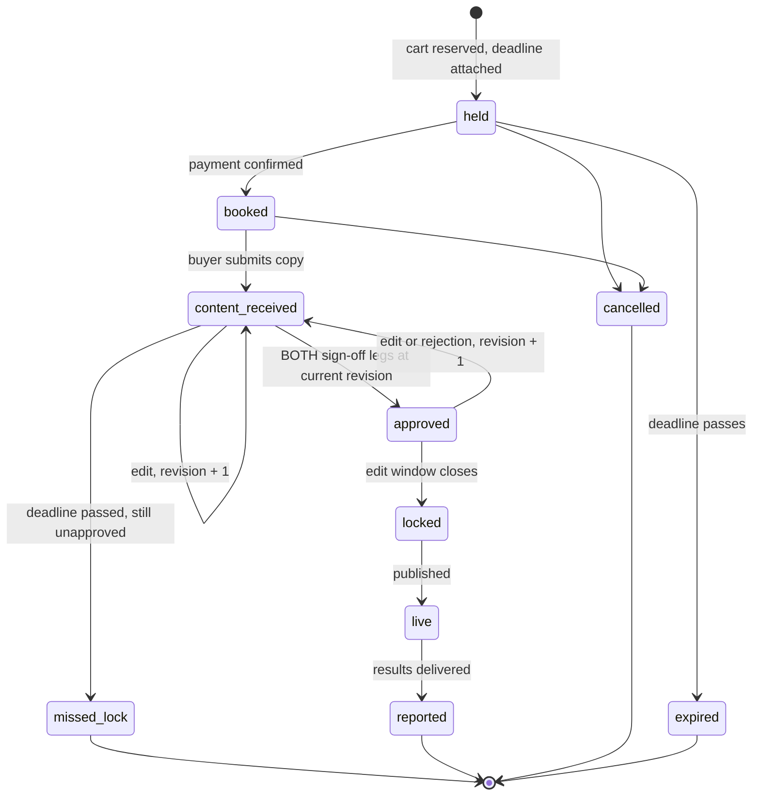
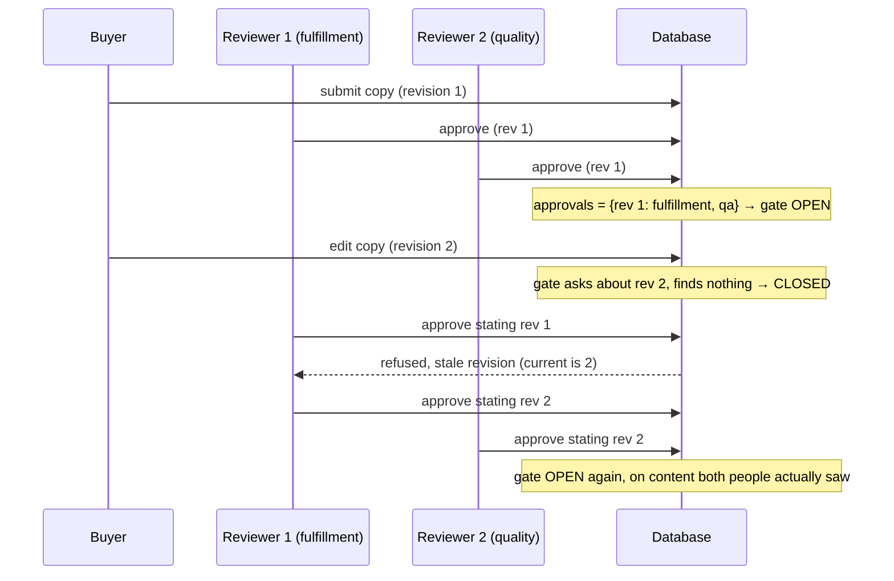
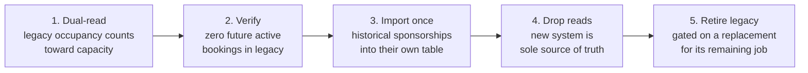

# Sponsor Operations Platform: a case study

Case study of a sponsorship-operations platform I designed and built for a newsletter
business with a 200,000+ reader list. It replaced a hand-run Notion process with a
public booking storefront and an internal operations console, and it went to
production with four staff admins on it.

**This repository is a write-up, not the product.** None of the production code, data,
schema, or business information is here. What is here is the reasoning, and four
patterns from the design rebuilt as standalone, tested, runnable illustrations. Those
live in [`patterns/`](patterns/) and are MIT licensed.

---

## 1. The problem

Sponsorship inventory was sold and delivered by hand out of a Notion database and a
shared inbox. That works until it does not, and the ways it stops working are all
expensive:

| Failure | What it looked like in a manual process |
|---|---|
| **Double-booking** | Two people promise the same slot in the same issue. Only visible when the issue is assembled. |
| **Silent capacity drift** | One product is capped per issue, another per publishing week. A human counting rows gets the second kind wrong. |
| **Unreviewed content shipping** | Copy is approved, then edited, then published. The approval was for a version that no longer exists. |
| **Stale reservations** | A slot is verbally held for a deal that died three weeks ago. Nobody remembers to release it. |
| **Refund arithmetic** | A buyer on volume pricing cancels part of their order and quietly keeps the volume rate on what remains. |
| **No pacing signal** | Nobody can answer "how much of this month is sold" without opening a dozen pages. |

Every one of those is a rule that a database can hold and a person cannot hold
reliably at volume. That framing drove the whole build.

---

## 2. The system

Two surfaces over one database.



The important line in that diagram is that **every surface goes through the same
functions**. The storefront and the booking desk are two very different callers with
two very different sets of privileges, and they ask exactly one implementation whether
a slot is free.

### The booking lifecycle



Two details in there are load-bearing and neither is obvious:

- `missed_lock` still **occupies capacity**. A sponsor who missed the content deadline
  has not released the slot. Treating that state as free would resell a committed
  position.
- `approved` is not sticky. It is derived from approvals recorded against the
  *current* content revision, so an edit un-approves the item without anything having
  to remember to clear a flag.

### The dual sign-off gate

Paid third-party content going to a list that size gets two humans on it: one checking
it is what the client bought, one checking it is fit to send. The naive version is two
boolean columns, and the naive version has a hole:



An approval is a row keyed by `(item, revision, leg)`, not a flag on the item. An
approval for revision 1 does not answer a question about revision 2, so approvals are
never cleared, they simply stop matching. A reviewer must submit the revision they
believe they are approving, which is what catches the edit-while-the-review-tab-is-open
race. The two legs must be different people. Old approvals stay on record as the audit
trail of who signed off on what.

Runnable version: [`patterns/revision_bound_approval/`](patterns/revision_bound_approval/).

---

## 3. Engineering decisions, and why

### The database is the product; the app is disposable

Every invariant that costs money if it breaks lives in Postgres as a function:
capacity, holds, payment confirmation, approvals, the revenue ledger, cancellation and
reprice. The web tier calls those functions and renders the result.

The reasoning: application processes get rewritten, redeployed, run in several copies,
and occasionally run two versions at once during a rolling deploy. A correctness rule
that lives in one of them is a rule that a second caller can skip. A rule that lives in
the database is enforced against every caller including a hand-typed `psql` session at
2am. Capacity was proven once and then survived a frontend rewrite, a payments change,
and the removal of an entire upstream integration without being re-argued.

The cost is real and worth naming: SQL functions are harder to unit test than Python,
and schema changes need an expand-contract discipline. I took that trade because the
failure mode on the other side is overselling inventory to a paying customer.

### Check and write are one operation, under a lock, in scope-key order

The double-booking bug is not "we forgot to check". It is "we checked, and then we
wrote". Two carts can both pass the check before either writes.

So the check and the write are one function call. Inside it, each affected slot takes
an advisory lock keyed on `product:scope_key`, and the locks are taken in **sorted
order** so two overlapping multi-slot carts serialize instead of deadlocking. Under
that lock, the cart is grouped by scope key and the **group** quantity is compared to
the cap, because two lines for one slot checked independently will both pass against a
cap of one.

Runnable version: [`patterns/slot_capacity/`](patterns/slot_capacity/).

### One definition of "which bucket does this date count in"

Some products cap per issue, some per publishing week. Rather than branch at every call
site, a single `scope_key_for(product, date)` maps a date to either an ISO date or an
ISO week key, and every read, every override, and every lock goes through it. Closing a
week for a per-week product from any day inside that week then works for free, because
there is no second place where a date becomes a bucket.

### Money states are monotonic and idempotent

Payment webhooks retry. A confirm that has already happened returns success without
doing anything a second time. A paid order cannot be walked backwards by a hold
sweeper. An invoice reference is unique across orders, so the same reference on the
same order is idempotent and on a different order is refused.

The one that took a second pass: a hold can lapse between checkout starting and the
webhook arriving. Confirming then has to re-win capacity for the lapsed portion, as a
group per slot, before taking the money. Otherwise the system takes payment for a slot
it already resold.

### Extending a reservation adds time, it does not reset it

This shipped wrong and is my favorite bug in the project. "Extend hold by 72 hours"
was implemented as `expiry = now + 72h`. Applied to a three-day hold with 60 hours
left, it bought 12 hours, and the UI reported success. Nothing errored, nothing
alerted, and the number on screen was plausible.

The rule is now `min(created_at + ceiling, max(now, current_expiry) + delta)`, and an
extension that buys no additional time is **refused** rather than reported as success.
The ceiling is measured from creation, not from the last extension, so a slot cannot be
held indefinitely in 72-hour increments. Reviving a hold that already lapsed has to
re-win capacity, because the seat was genuinely free while it was lapsed.

Validation runs over every slot in the order before any of them is mutated. A one-pass
version that fails on the fourth slot has already extended the first three.

Runnable version: [`patterns/rep_holds/`](patterns/rep_holds/).

### Pricing is one pure function, and a partial cancel reprices what remains

Volume pricing plus partial cancellation is a discount leak. Buy four at the volume
rate, cancel two, and if the refund is "what those two lines cost" the buyer keeps
volume pricing on a two-line order.

Refund is therefore `paid - (remaining cart repriced at its new tier)`. The pricing
engine is pure, with no I/O, so the checkout screen, the ledger, and the refund
calculation cannot disagree. Add-ons price at face value and are excluded from the tier
count, so a cheap extra cannot tip a cart into a volume band.

Runnable version: [`patterns/tiered_pricing/`](patterns/tiered_pricing/).

### Two isolated deployments, one repository

The new platform was deployed as a separate serverless application from the existing
revenue-critical automation, in the same repository. A bad deploy of the new thing
cannot take down the thing that was already earning. Shared repository, shared review,
separate failure domain.

### No build step on the frontend

Vanilla JS served directly, no bundler. For an internal console with four users and a
storefront that is mostly a calendar and a cart, a build pipeline is a dependency-audit
surface and a deploy step in exchange for very little. This is a decision I would
revisit at ten times the UI surface area, and it is worth saying so: it is the right
call for this size and it does not generalize.

---

## 4. The migration

Moving off Notion was the risky part, because the old system held live commitments to
paying customers. The order of operations was the whole design:



1. **Dual-read first.** Before the new system could sell anything, it counted the old
   system's bookings toward capacity. A slot committed in Notion was full in the new
   calendar. This is the step that makes the cutover boring.
2. **Verify, do not assume.** The cutover was gated on a live query proving zero future
   active bookings remained in the legacy source. If any had, dropping legacy occupancy
   from the capacity calculation would have oversold a real committed slot. The check
   was run against the live data, not against a document describing the live data.
3. **Import history once, into a table that admits it is history.** Roughly twenty past
   sponsorships moved into a dedicated table carrying the raw labels as recorded plus
   the provenance id, keyed so a re-run is idempotent. Deliberately *not* mixed into the
   live bookings table: historical records with unclean statuses do not belong in the
   table that capacity math reads.
4. **Stop reading, do not immediately drop.** Expand-contract. The release stopped using
   the legacy columns; removing them was a later, separate change. A rolling deploy has
   both code versions live at once, and dropping a column out from under the old one is
   how a migration becomes an outage.
5. **Leave the last integration alone until its job has a replacement.** One legacy
   automation still served live records. It was left running and idle rather than being
   ripped out on principle, and its retirement was scheduled behind a native
   replacement for the one thing it still did.

Alongside this: a **CSV import** path for content produced outside the system, with a
server-side re-parse of the uploaded file rather than trusting a client-side
interpretation, deterministic delimiter detection instead of heuristic sniffing,
duplicate-header rejection, and an explicit per-row error on a malformed row rather
than a guess at which column was meant. Import is a place where "be lenient" quietly
becomes "publish the wrong thing to 200,000 people".

---

## 5. Verification

How the work was checked, stated at the level it was actually proven. The
numbers that were independently confirmed at cutover are the four in section 6;
everything below describes method, not measured outcomes.

- **Adversarial review as a gate, not a formality.** Each significant change went
  through independent review rounds, including a second model from a different vendor
  reviewing the diff specifically for what it would break. The rep-hold reset bug, the
  lapsed-hold capacity recheck, and the stale-quote guard on partial cancellation all
  came out of those rounds rather than out of the test suite.
- **A real UAT with a non-author admin.** A colleague who had not built the system ran
  the operational flows. Nine defects were fixed off the back of that session: three
  the tester hit directly, six more found by the adversarial round those findings
  triggered. Several were things no amount of self-testing would have surfaced,
  because they were about what a second person assumed the buttons meant.
- **Live-surface verification, separated from test-suite verification.** What was
  exercised against the running production surface was recorded separately from what
  was covered by tests only. Hosted checkout was verified end to end in test mode and
  the live-mode handoff was verified in production. Paths that had not been exercised
  with a real charge were written down as unverified rather than described as done,
  which is the habit this section is really about: a green suite is the floor, not
  the finish line.

---

## 6. Outcome

The four confirmed outcomes:

- Shipped to production and adopted: **4 staff admins** working in it.
- **20 sponsor records** migrated off Notion in a verified one-time import; Notion
  removed as a dependency of the new system.
- **Stripe checkout live and verified**, replacing a manual invoice-and-chase loop.
- **61 tests green** on the production build at cutover.

In shape rather than in numbers: sponsorship operations moved from a hand-run Notion
process to a system with enforced capacity, an auditable two-person approval gate
bound to content revisions, and revenue pacing.

Deliberately not stated anywhere in this repository: revenue, pricing, sponsor
identities, internal URLs, and operating metrics. Those belong to the business, not
to the write-up.

---

## 7. The extracted patterns

Four ideas from the design, rebuilt from scratch as standalone Python with no
dependencies beyond `pytest`. They are illustrations of the reasoning above, tested with the
same discipline the production versions were. They are **not** the production
code, they carry no business data, and their catalogs and prices are invented
placeholders.

| Pattern | The rule it enforces |
|---|---|
| [`slot_capacity`](patterns/slot_capacity/) | Booking-conflict checking with per-issue and per-week caps behind one scope key, group-checked carts, holds that expire, and operator overrides |
| [`revision_bound_approval`](patterns/revision_bound_approval/) | Two-person sign-off bound to the exact content revision it approved |
| [`rep_holds`](patterns/rep_holds/) | Extendable sales reservations with an absolute ceiling, and a lapsed hold that has to re-win its slot |
| [`tiered_pricing`](patterns/tiered_pricing/) | Volume-tier pricing and the partial-cancel reprice that closes the discount leak |

Run them:

```bash
git clone https://github.com/joydai2026-del/sponsor-ops-case-study.git
cd sponsor-ops-case-study
python3 -m venv .venv && source .venv/bin/activate
pip install pytest
python -m pytest -q
```

110 tests, no other dependencies, Python 3.11+.

---

## License

The extracted patterns in [`patterns/`](patterns/) and their tests are MIT licensed
(see [LICENSE](LICENSE)). The written case study is a description of work done for a
client and does not grant any rights to that client's system, data, or business
information.
